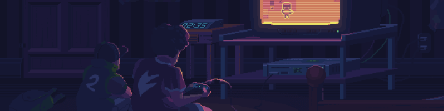

<h1 align="center">  
  ¡Hola! Soy Daniel 👋  
</h1>  

  
  <b>Desarrollador & Ingeniero en Sistemas</b> de Cali, Colombia 🇨🇴  

  

  
    
    
    
    

  

---

  

---

## 🚀 Sobre mí  

- 💻 Apasionado por la **tecnología y el desarrollo de software**  
- 🌱 Actualmente aprendiendo **nuevas arquitecturas y frameworks modernos**  
- 🎯 Objetivo: contribuir a proyectos de **impacto global**  
- ⚡ Fun fact: Soy fan del **lofi y el café ☕** mientras programo  

---

## 📈 Estadísticas de GitHub  

|  |  |  
|---|---|  

---

## 🔧 Tecnologías & Herramientas  

  
    
    
    
    
    
    
    
    
    
    

  

---

## 🌍 Proyectos Destacados  

- 🚧 *(Próximamente puedes destacar aquí tus proyectos más importantes con links e imágenes)*  

---

✨ Gracias por visitar mi perfil! Si quieres colaborar en algo interesante, no dudes en contactarme. 🚀 
