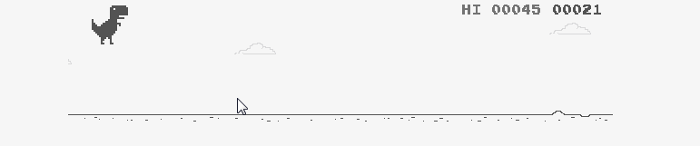

<h1 align="center">
  Hola! soy Daniel👋
</h1>

Mi nombre es Daniel Rodriguez y soy un desarrollador / tecnólogo en sistemas. Soy de Colombia, vivo en Cali y actualmente Estudio Ingeniería de Sistemas. Puedes encontrarme en [![Twitter][1.2]][1] o LinkedIn.

<h2>📈 Estadísticas de GitHub </h2>

|||
|---|---|
||| 

<h2>🔧 Tecnologías y herramientas</h2>

[1.1]: http://i.imgur.com/tXSoThF.png (twitter icon with padding)
[2.1]: http://i.imgur.com/0o48UoR.png (github icon with padding)

[1]: https://twitter.com/MissingRed07
[2]: https://github.com/MissingRed07

